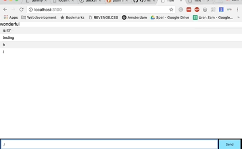

# Hangman Chat
A simple chat with hangman where you can play hangman in with others.

# Table of Content
- [Getting started](#getting-started)
- [Features](#features)
- [What's used](#What's-used)
- [To Do](#To-Do)

# Getting started
Change the branch to hangman ;)
Here is how to get started:
1. Download or clone the repo `git clone https://github.com/kyunwang/hangman-chat.git`
2. Run `npm install` or `yarn`
3. Do a `npm start`
4. Go to **localhost:3100** and you are ready to go.

# Features
* socket.io is beeing used to make the app realtime.  
You can now use the app to  talk with eachother and send messages.  
In this case to play hangman!

* Using pug as templating render engine to communicate with the browser.

# What's used
* [Socket.io](https://socket.io/)
* [Pug](https://pugjs.org/api/getting-started.html)

# To Do
* Finishing the app, making the game real like hangman.
